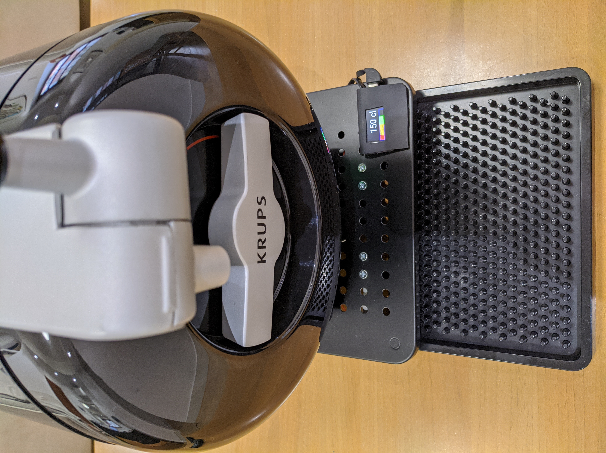

# Display del livello per The Sub
Se possedete uno spillatore di birra [The Sub](https://www.beerwulf.com/en-gb/the-sub), probabilmente sentirete la mancanza di un indicatore che mostri la quantità  del prezioso liquido rimasto nel Torp ...

Questo progetto usa quattro celle di carico ed un ESP32 con display incorporato per realizzare una bilancia con un indicatore di quanta birra è rimasta da spillare. Inoltre la base usata per ospitare The Sub ha dei fori che per la circolazione dell'aria che aiutano la refrigerazione.

  

Il codice usa il progetto [EspHome](https://esphome.io/) per integrarsi con [Home Assistant](https://www.home-assistant.io/), ma può anche essere usato da solo.

## Materiale usato
Per realizzare la bilancia ho usato (i link sono le fonti che ho usato per comprarli...)
 - 1 x Scheda LILYGO® TTGO T-Display 1.14 Inch LCD Control Board with ESP32: https://www.aliexpress.com/item/33048962331.html
 - 4 x Celle di carico da 5kg: https://www.aliexpress.com/item/33051349806.html
 - 1 x Modulo ADC HX711: https://www.aliexpress.com/item/33051349806.html
 - 1 x Supporto per Monitor: https://www.amazon.it/gp/product/B07L86BK3F/ - https://www.amazon.com/dp/B07H4DMLVH
 - 4 x Gommini
 - fili colorati
 - 1 x Cavo telefonico a 4 poli
 - viti, bulloni e dadi vari

## Schema

  

Lo schema di collegamento è semplicissimo: collegate insieme i fili delle celle di carico, ognuno secondo il proprio colore e poi collegateli agli ingressi del modulo HX711.

Quando lo fate, NON FIDATEVI DELLA CODIFICA STANDARD DEI COLORI e chiedete sempre al venditore la sequenza giusta di collegamento (ovvero quale colore va in quale ingresso: nel mio caso era Rosso<->E+, Nero<->E-, Bianco<->A- e Verde<->A+).

Poi, usando il cavo telefonico a 4 fili, collegate VCC al PIN 3V, GND al PIN G, DT al PIN27 e SCK al PIN26 ed è fatta (potete usare altri pin per DT e SCK, ma ovviamente dovrete modificare il codice YAML di conseguenza).

## Montaggio
Usando qualche vite e dado, realizzate 4 piedini per le celle di carico, poi fissatele al sopporto per monitor (nel mio caso, per fortuna, i fori del supporto e quelli delle celle di carico erano perfettamente allineati...)

  

Poi fissate la scheda T-Display alla parte superiore del supporto, facendo passare il cavo telefonico dove preferite. 

Il risultato finale, visto da sotto, dovrebbe essere una cosa simile:

  

e questa è la vista da sopra:

  

## Calibrazione e uso
Dopo aver compilato e caricato lo YAML nella scheda, dovete calibrare la bilancia per poter misurare correttamente la quantità di birra nel Torp.

### Calibrazione
Per prima cosa caricate un Torp vuoto nel The Sub, poi tenete premuto il pulsante inferiore (bottom) per almeno 1,5 secondi: il display dovrebbe mostrarvi una richiesta di conferma; confermate con un click del pulsante superiore (top) e lasciate completare la calibrazione.

Poi procedete ad inserire un Torp nuovo, tenete premuto il pulsante superiore per almeno 1,5 secondi, confermate con un click sul pulsante inferiore e lasciate completare la calibrazione. Dopo aver fatto la calibrazione del Torp pieno, il display vi chiederà conferma dell'inserimento di un nuovo Torp, per resettare il tempo di apertura del Torp.

### Uso
Il display si spegne dopo 1 minuto, per riaccenderlo basta un click su un pulsante.

Mentre spillate una birra, il display si accende e l'indicatore resta bloccat fino a che non rilasciate la leva (dopo tutto è una bilancia e la pressione farebbe schizzare il carico a fondo scala...).

Potete cambiare il display per mostrare quando avete aperto il Torp cliccando un pulsante qualsiasi.
