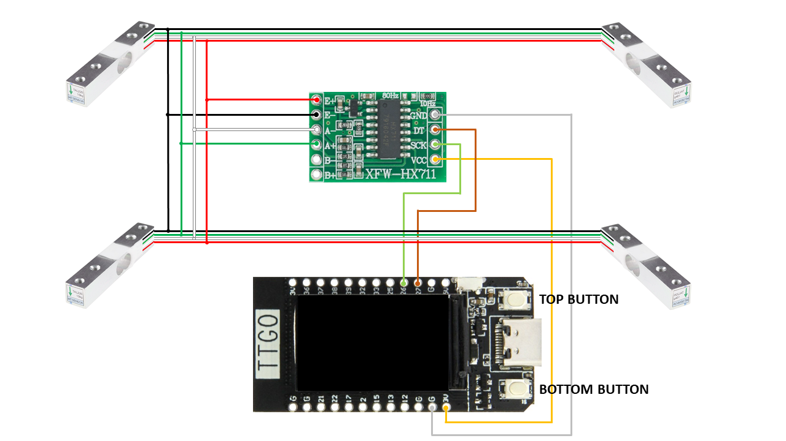

# The Sub beer meter
If you own a [The Sub](https://www.beerwulf.com/en-gb/the-sub) beer tap, you will probably miss a level indicator that shows you how much beer is left inside your loaded Torp...

This project uses four load cells to build a custom scale connected to an ESP32 with an LCD to show a gauge level of how much beer is available for your pours. As an added bonus, the stand used to hold The Sub has ventilation holes that improve the air circulation and enhance the refrigeration efficiency.

  

The code is written with [EspHome](https://esphome.io/) to integrate with [Home Assistant](https://www.home-assistant.io/), but can be also used stand-alone.

## Shopping list

 You will need (the sources where I bought them are in the links...)
 - 1 x LILYGO® TTGO T-Display 1.14 Inch LCD Control Board with ESP32: https://www.aliexpress.com/item/33048962331.html
 - 4 x 5kg Load cell: https://www.aliexpress.com/item/33051349806.html
 - 1 x HX711 ADC Module: https://www.aliexpress.com/item/33051349806.html
 - 1 x Monitor Stand Riser: https://www.amazon.it/gp/product/B07L86BK3F/ - https://www.amazon.com/dp/B07H4DMLVH
 - 4 x Rubber pads
 - colored wires
 - 1 x 4-wires phone cord cable
 - bolts and nuts

## Schema

  

Wiring schema is really simple: just connect together, according to the respective color, the wires of the four load cells, then connect them to the input side of the HX711 ADC board.

In so doing, DON'T TRUST THE COLOR CODING and ask the vendor for the right connection (i.e. which color goes in which input; in my case it was Red<->E+, Black<->E-, White<->A- and Green<->A+).

Then, using the 4-wires phone cord, connect VCC to PIN 3V, GND to PIN G, DT to PIN27 and SCK to PIN26 and you are done (you can use other pins for DT and SCK, but then you must reflect the change in YAML code).

## Assembly
Use some of the nuts and bolts to build four foot for the load cells, then fix them to the bottom of the Monitor Stand (I was quite lucky and the holes in the stand exactly matched the holes in the load cells...)

  

Then fix the T-Display board on the top of the stand, routing accordingly the phone cord. 

The bottom view of the final result shoud looks like this:

  

while this is a look from above:

  

## Calibration and Usage
After having compiled and flashed the YAML, you need to calibrate the scale in order to correctly measure the beer inside your Torp.

### Calibration
First load an empty Torp in The Sub, then hold the bottom button for at least 1.5 seconds: the display should prompt a confirmation text, confirm with a single click on the top button and let the empty calibration complete.

Then load a full Torp, hold the top button for at least 1.5 seconds, confirm by clicking on the bottom button and let the full calibration complete. After the full calibration is completed, it will prompt you to confirm that you loaded a new Torp, in order to reset the Torp age.

### Usage
The display will turn off after 1 minute, you can turn it back on by clicking one of the buttons.

When pouring a pint of beer, the display will turn on and the indicator will freeze until you release the pressure (after all this is a scale and it would jump to full load under pressure...).

You can change from level display to torp age display by clicking one of the buttons.

